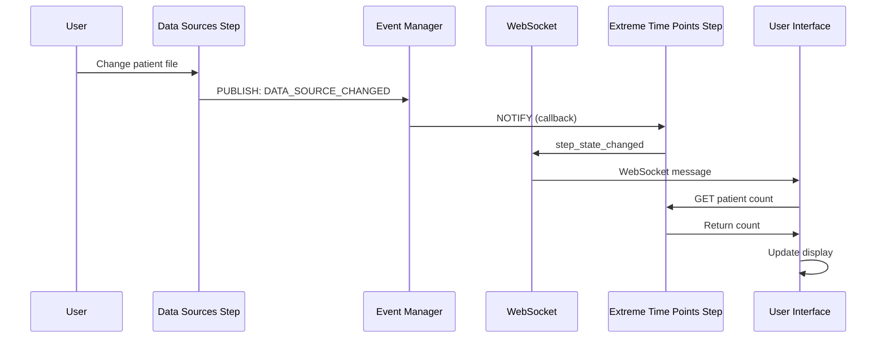
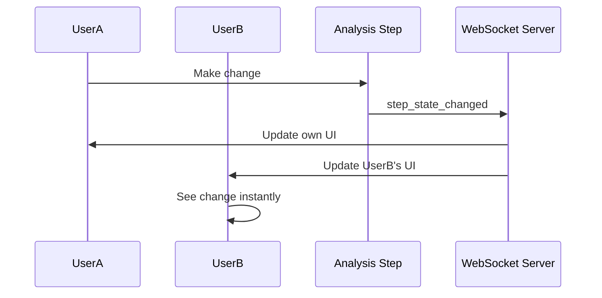

# 00_EventDrivenStepCommSys.md: Event-Driven Step Communication System

## Overview

This document specifies the **Event-Driven Communication System** for the modular analysis pipeline. The system enables inter-step communication and dependency management while maintaining clean separation between analysis steps.

## Problem Statement

In the modular architecture, analysis steps are isolated but need to communicate:
- Data source changes should update dependent steps (e.g., extreme time points)
- UI components need real-time updates when dependencies change
- Steps need access to other steps' state without tight coupling

## Core Architecture

### Publish-Subscribe Pattern

The system implements a **publish-subscribe pattern** where:
- **Publishers** (steps) emit events when their state changes
- **Subscribers** (steps/UI) listen for events they're interested in
- **Event Manager** coordinates message routing

### Key Components

#### 1. Step Communication Manager (Backend)

```python
class StepCommunicationManager:
    """Manages communication between analysis steps"""

    def subscribe(self, event: StepEvent, step_id: str, callback: Callable):
        """Subscribe to events from other steps"""

    def publish(self, event: StepEvent, source_step_id: str, data: Dict[str, Any]):
        """Publish event to all subscribers"""

    def get_step_state(self, step_id: str) -> Dict[str, Any]:
        """Get current state of a step"""
```

#### 2. Step Events

```python
class StepEvent(Enum):
    DATA_SOURCE_CHANGED = "data_source_changed"
    COLUMN_GROUP_CHANGED = "column_group_changed"
    TIMEPOINT_CHANGED = "timepoint_changed"
    PARAMETER_VALIDATED = "parameter_validated"
    STEP_COMPLETED = "step_completed"
```

#### 3. WebSocket Event Manager (Frontend)

```javascript
class StepEventManager {
    subscribe(event, sourceStepId, callback) {
        // Subscribe to step events
    }

    publish(event, sourceStepId, data) {
        // Publish events to subscribers
    }
}
```

## Step Integration

### Base Step Class Updates

```python
class BaseAnalysisStep(ABC):
    def publish_event(self, event: StepEvent, data: Dict[str, Any]):
        """Publish event to other steps"""
        step_communication.publish(event, self.step_id, data)

    def get_step_state(self, step_id: str) -> Dict[str, Any]:
        """Get state of another step"""
        return step_communication.get_step_state(step_id)

    def _setup_event_subscriptions(self):
        """Setup subscriptions to relevant events (override in subclasses)"""
        pass
```

### Example Step Implementation

#### Data Sources Step (Publisher)

```python
class DataSourcesStep(BaseAnalysisStep):
    step_id = "data_sources"

    def _setup_event_subscriptions(self):
        pass  # No subscriptions - this is a source step

    def execute_method(self, method_id, parameters, dataset_id, context=None):
        result = super().execute_method(method_id, parameters, dataset_id, context)

        if result.get('success'):
            self.publish_event(StepEvent.DATA_SOURCE_CHANGED, {
                'patient_file': result.get('patient_file'),
                'taxonomy_file': result.get('taxonomy_file'),
                'bracken_file': result.get('bracken_file'),
                'dataset_id': dataset_id
            })

        return result
```

#### Extreme Time Points Step (Subscriber)

```python
class ExtremeTimePointsStep(BaseAnalysisStep):
    step_id = "extreme_time_points"

    def _setup_event_subscriptions(self):
        step_communication.subscribe(
            StepEvent.DATA_SOURCE_CHANGED,
            "data_sources",
            self._on_data_source_changed
        )

    def _on_data_source_changed(self, data: dict):
        """Handle data source change event"""
        self._current_data_sources = data

        if hasattr(self, '_ui_active') and self._ui_active:
            self._update_patient_counts(data)

    def get_method_ui_config(self, method_id, dataset_id, context=None):
        config = super().get_method_ui_config(method_id, dataset_id, context)

        data_sources = self.get_step_state("data_sources")
        if data_sources.get('patient_file'):
            config['patient_count'] = self._get_patient_count(
                data_sources['patient_file'], dataset_id
            )

        return config
```

## WebSocket Implementation

### Backend (Flask-SocketIO)

```python
from flask_socketio import SocketIO, emit, join_room

socketio = SocketIO(app)

@socketio.on('join_analysis')
def handle_join_analysis(data):
    """User joins analysis session"""
    analysis_id = data['analysis_id']
    join_room(f'analysis_{analysis_id}')

    emit('analysis_state', get_current_analysis_state(analysis_id))

@socketio.on('step_state_changed')
def handle_step_state_change(data):
    """Step state changed, broadcast to room"""
    analysis_id = data['analysis_id']
    step_id = data['step_id']
    new_state = data['state']

    emit('step_updated', {
        'step_id': step_id,
        'state': new_state,
        'timestamp': datetime.now().isoformat()
    }, room=f'analysis_{analysis_id}')
```

### Frontend (JavaScript)

```javascript
class ModularAnalysisManager {
    constructor(datasetId) {
        this.datasetId = datasetId;
        this.socket = io();
        this.setupWebSocketHandlers();
        this.setupStepEventHandling();
    }

    setupWebSocketHandlers() {
        this.socket.emit('join_analysis', { analysis_id: this.datasetId });

        this.socket.on('step_updated', (data) => {
            this.handleStepUpdate(data);
        });

        this.socket.on('analysis_state', (data) => {
            this.handleAnalysisState(data);
        });
    }

    setupStepEventHandling() {
        stepEventManager.subscribe('data_source_changed', 'data_sources',
            (data) => this.handleDataSourceChange(data));
    }

    handleDataSourceChange(data) {
        // Update UI immediately
        this.updateExtremeTimePointsUI(data);

        // Broadcast to other users
        this.socket.emit('step_state_changed', {
            analysis_id: this.datasetId,
            step_id: 'data_sources',
            state: data
        });
    }

    async updateExtremeTimePointsUI(data) {
        if (data.patient_file) {
            const response = await DatasetUtils.api.call(
                `/dataset/${this.datasetId}/file/${data.patient_file}/patient-count`
            );

            if (response.success) {
                this.updatePatientCountDisplay(response.patient_count);
            }
        }
    }
}
```

## Event Flow Examples

### Example 1: Data Source Change



### Example 2: Real-time Collaboration



## Benefits

### 1. Loose Coupling
- Steps communicate through events, not direct references
- Easy to add/remove steps without breaking others
- Clean separation of concerns maintained

### 2. Real-time Updates
- UI updates instantly when dependencies change
- No polling or manual refresh required
- Responsive user experience

### 3. Scalability
- Easy to add new event types
- Multiple subscribers per event
- Efficient message routing

### 4. Debugging & Monitoring
- Clear event flow for troubleshooting
- Event logging and monitoring
- State tracking for debugging

## Implementation Strategy

### Phase 1: Core Infrastructure
1. Create StepCommunicationManager class
2. Update BaseAnalysisStep with event methods
3. Implement basic event publishing/subscribing

### Phase 2: Step Integration
1. Add event subscriptions to dependent steps
2. Implement event publishing in source steps
3. Test inter-step communication

### Phase 3: WebSocket Integration
1. Add Flask-SocketIO to backend
2. Implement WebSocket event handlers
3. Add real-time UI updates

### Phase 4: Advanced Features
1. Multi-user collaboration support
2. Event persistence and replay
3. Performance monitoring

## Error Handling

### Graceful Degradation
- If WebSocket fails, fall back to HTTP polling
- If event subscriber fails, log error but continue
- State recovery mechanisms for reconnection

### Validation
- Event data validation before publishing
- Subscriber callback error handling
- Event loop protection (prevent infinite loops)

### Monitoring
- Event throughput monitoring
- Failed delivery tracking
- Performance impact assessment

## Security Considerations

### Authentication
- WebSocket connections require valid session
- Event data validation on server side
- Rate limiting for event publishing

### Authorization
- Users can only join analyses they have access to
- Step state visibility based on permissions
- Event broadcasting restricted to authorized users

## Testing Strategy

### Unit Tests
- Event publishing and subscribing
- Step state management
- WebSocket connection handling

### Integration Tests
- Inter-step communication flows
- Real-time UI updates
- Multi-user scenarios

### Performance Tests
- Event throughput under load
- Memory usage with many subscribers
- Network latency impact